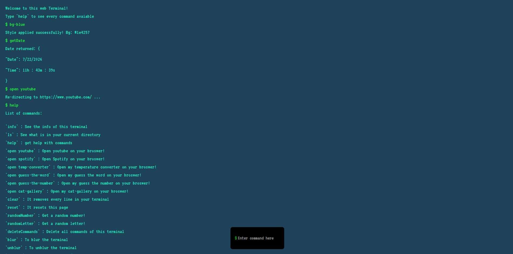
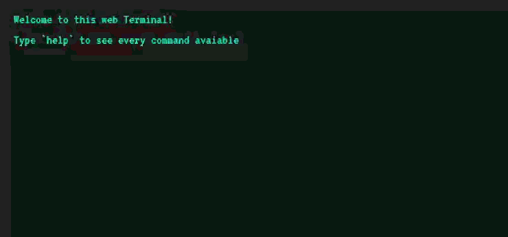
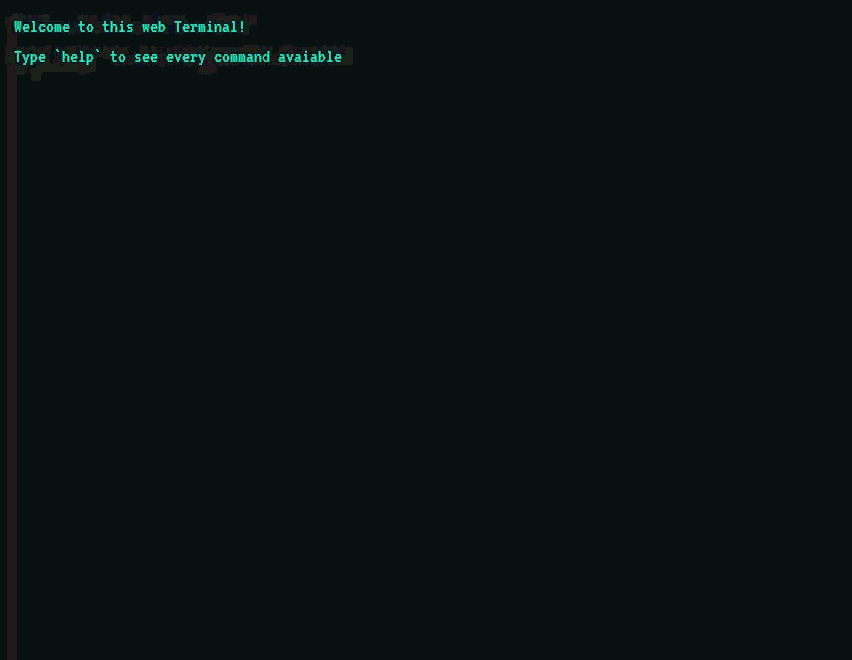

# Dev Terminal
Welcome to the web terminal! Here you can do things like check the current date, change the background, open links more efficiently, and more!

Make sure to see all commands typing `help` in the terminal!

You can try it [Here](https://brundevcoder.github.io/terminal/)

## about the design

- About the fonts I used in this terminal, I used `VT323` to give that old/retro look.
- The colors used here are quite simple: for the normal background, I preferred to use `#20201f`, for the strings the color `rgb(30, 221, 189)`, for numbers the color `#d8b61e` and finally, for errors, a very pure red `#ff0000`.

Also, every new line of command / output, there is a quick flash on the line, like this:

(sorry for the poor quality)

furthermore, if you enter a command that does not exist or you give a null command, you will get an error like this:

## How to run it

After cloning this repository, simply open the `index.html` file directly fromt the files, or you can use the Live Server extension in Vs Code!